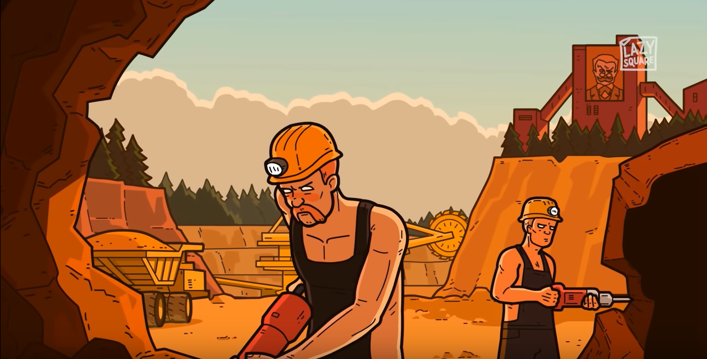

# The Process:

The following steps are supposed to be performed within the modelling process 

## 1. Mine a model
Find a model that resolves a task better than others within it's class

## 2. Do standard tests

There is a standard testing processes for tasks, and for a given one the tests
should be performed

## 3. Prepare the model to prod

Just make the pipeline standard enough to be pushed to prod and maintained easily

## 4. Run the model in production

Now it works fine, enjoy

## 5. Validate production results of the model

Find out if it is good enough in action

## 6. Enjoy!

You've done a great work

